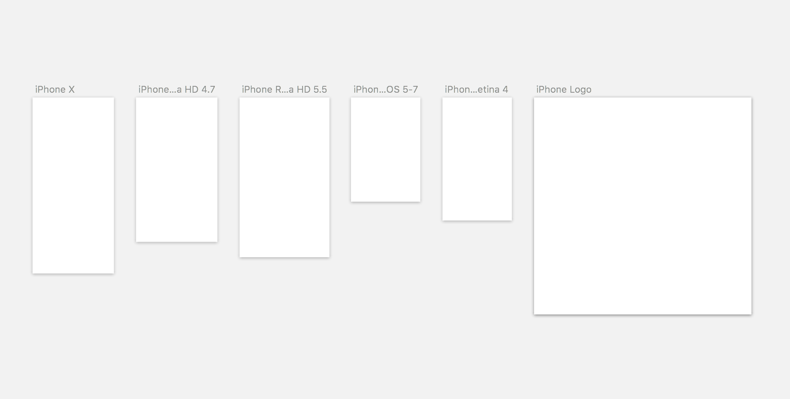
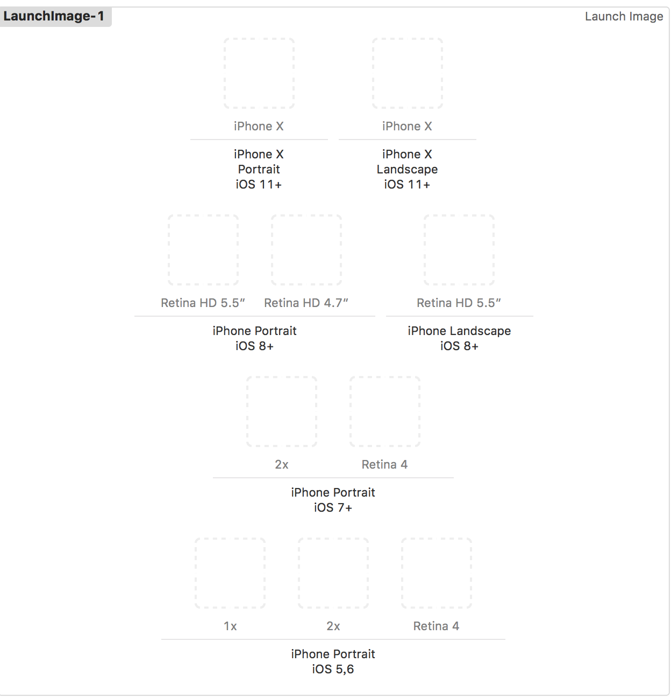

# iPhone launch image

Ues Sketch to cut image for iPhone launch image.

## Sketch Preview

## Xcode Launch Image Preview

## File Map

| type | file | 
|------|------|
|iPhone X Portrait iOS 11+  | iPhone X@3x.jpg|
|iPhone X Landscape iOS 11+ | iPhone X@3x.jpg|
|iPhone Portrait iOS 8+ (Retina HD 5.5") | iPhone Retina HD 5.5@3x.jpg|
|iPhone Portrait iOS 8+ (Retina HD 4.7") | iPhone Retina HD 4.7@2x.jpg|
|iPhone Landscape iOS 8+ (Retina HD 5.5")| iPhone Retina HD 5.5@3x.jpg|
|iPhone Portrait iOS 7+ (2x) |iPhone Protrait iOS 5-7@2x.jpg|
|iPhone Portrait iOS 7+ (Retina 4) | iPhone Protrait iOS 5-7  Retina 4@2x.jpg|
|iPhone Portrait iOS 5,6 (1x) | iPhone Protrait iOS 5-7@1x.jpg|
|iPhone Portrait iOS 5,6 (2x) | iPhone Protrait iOS 5-7@2x.jpg|
|iPhone Portrait iOS 5,6 (Retina 4) | iPhone Protrait iOS 5-7  Retina 4@2x.jpg|

## Useage

Drag image file to Xcode corresponding section.

**NOTICE**:  if you don't want to use Portrait for Landscape. Update it yourself.